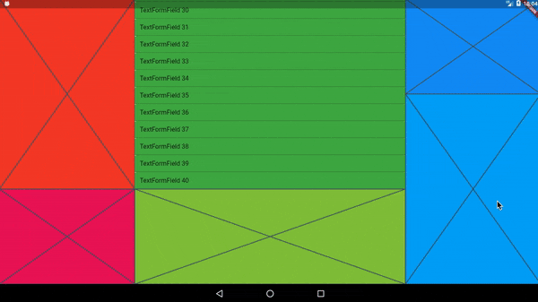

# keyboard_avoider

A lightweight alternative to the `Scaffold` widget for avoiding the on-screen software keyboard. Automatically scrolls obscured `TextField` child widgets into view on focus.



In the video above, every colored area is wrapped in its own `KeyboardAvoider`.

## Examples

A basic `Placeholder`:

```
import 'package:keyboard_avoider/keyboard_avoider.dart';

class MyWidget extends StatelessWidget {
  @override
  Widget build(BuildContext context) {
    return KeyboardAvoider(
      child: Placeholder(),
    );
  }
}
```

A `ListView` containing multiple `TextFields`, with auto-scroll enabled:

```
import 'package:keyboard_avoider/keyboard_avoider.dart';

class MyWidget extends StatelessWidget {
  final ScrollController _scrollController = ScrollController();

  @override
  Widget build(BuildContext context) {
    return KeyboardAvoider(
      autoScroll: true,
      child: ListView.builder(
        controller: _scrollController,
        itemCount: 40,
        itemBuilder: (context, index) {
          return TextFormField(
            initialValue: 'TextFormField ${index + 1}',
          );
        },
      ),
    );
  }
}
```


## Why not use a Scaffold?

Flutter comes with a built-in `Scaffold` widget that automatically adjusts the bottom padding of its body widget to accomodate the on-screen keyboard. However, it comes with 2 major caveats:
 
1. It pushes all content up, which you may not want.
1. It assumes that it fills the whole screen, which it may not.

In contrast, you can apply the `KeyboardAvoider` selectively to only certain widgets, and it only insets its bottom `padding` by the actual amount obscured by the keyboard.

## Auto Scroll

To auto-scroll to a focused widget such as a `TextField`, set the `autoScroll` property to `true`. If `child` is not a `ScrollView`, it is automatically embedded in a `SingleChildScrollView` to make it scrollable.